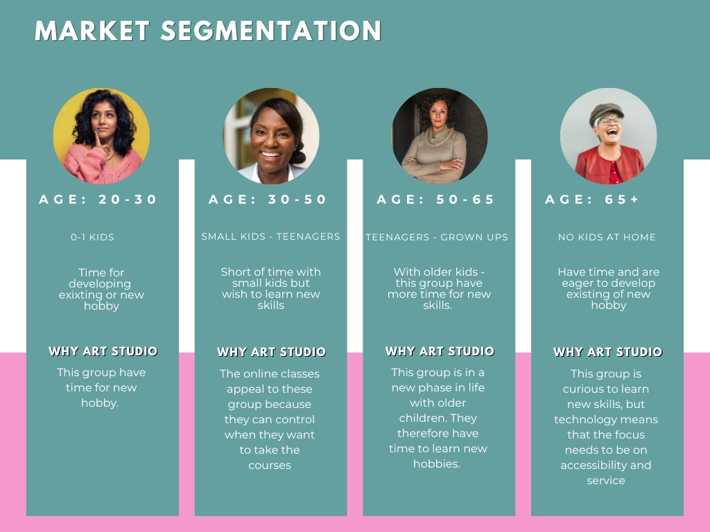
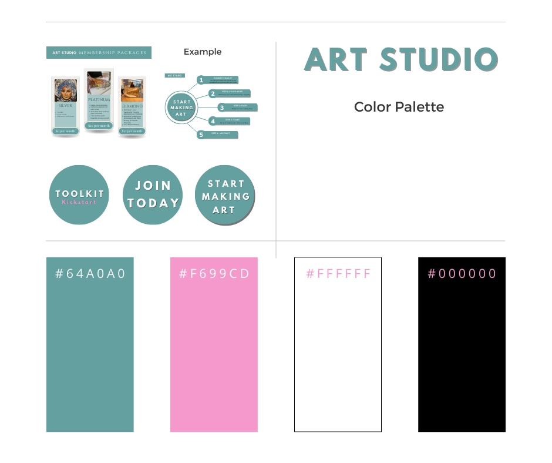
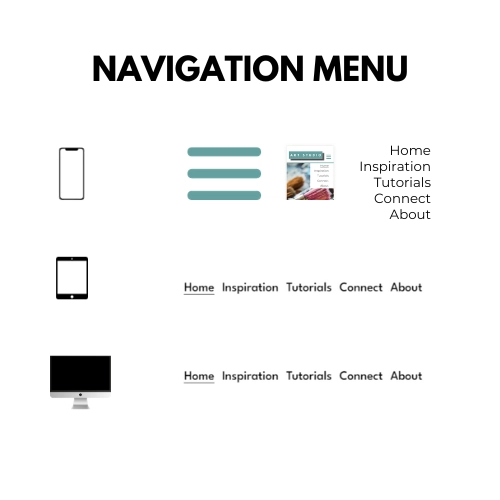
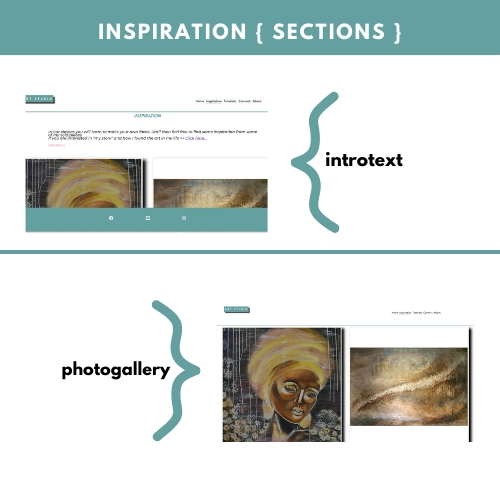
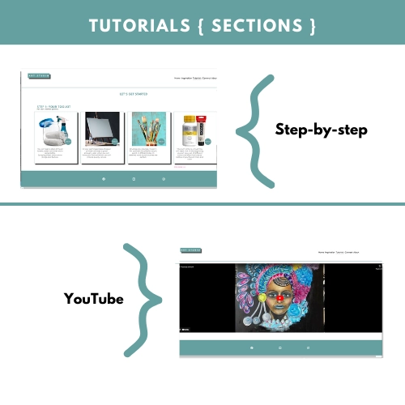
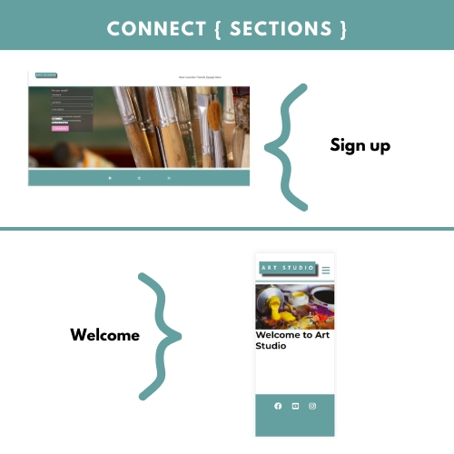
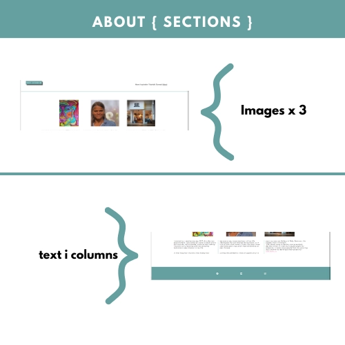

# ART STUDIO
Art Studio wants to increase creativity and wants to show that anyone can learn to make art. The creative process increases well-being and, just like physical activity, it gives a better mood, greater self-awareness and more energy. By offering membership at different levels, the site has great development potential as the number of members increases.
Art Studio a fictitious company, created as part of project work at the Code Institute.

## Tabel of contents
+ [UX](#ux "UX")
  + [Site Purpose](#site-purpose "Site Purpose")
  + [Site Goal](#site-goal "Site Goal")
  + [Business Strategy](#business-strategy "Business Strategy")
  + [Target Market](#target-market "Target Market")
  + [Communication](#communication "Communication")
+ [Design](#design "Design")
  + [Colour Scheme](#colour-scheme "Colour Scheme")
  + [Typography](#typography "Typography")
  + [Imagery](#imagery "Imagery")
+ [Features](#features "Features")
  + [Existing Features](#existing-features "Existing Features")
+ [Testing](#testing "Testing")
  + [Validator Testing](#validator-testing "Validator Testing")
  + [Unfixed Bugs](#unfixed-bugs "Unfixed Bugs")
+ [Technologies Used](#technologies-used "Technologies Used")
  + [Main Languages Used](#main-languages-used "Main Languages Used")
  + [Frameworks, Libraries & Programs Used](#frameworks-libraries-programs-used "Frameworks, Libraries & Programs Used")
+ [Deployment](#deployment "Deployment")
+ [Credits](#credits "Credits")
  + [Content](#content "Content")
  + [Media](#media "Media")

## UX

### Site Purpose:
To increase awareness around the creative process and show all benefits the creation has to body and soul by step by step tutorials and inspirering lifestories.

### Site Goal:
The first goal is to attracts new user to sign up and become members. 
The user should clearly understand what is being provided and should easly navigate on the page.  

### Business Strategy:

Art Studio is a fictive company but I want to show the commercial thought behind it anyway.
With people signing up you can offer different memberships and It can therefore be a page that has room to grow in step with members.

To attracts new members the site need to frequently upload classes, content and have other artist lifestories. 

### Target Market

Art Studio´s is a business to consumer company and the target market are mainly women 20-65 + years old.

### Communication
Communication plan will focus on: frequently update with new online classes, success stories and artwork from members
Social channels will mainly be Facebook and instagram
Directly email to those who sign up with automatic email

## Design

### Colour Scheme:
The page is filled with images that will inspires to create. The page's colors can therefore not take over the page's message. The combination of #64A0A0 and small fragment of #F699CD gives a pleasant impression that does not overwhelm the user.

Material, as buttons and presentations are designed so the user feel recognition, no matter where on the site he/she is on. 

The headings on all pages is in #64A0A0, except for on the sign up page where it is #F699CD since the background is black I want the heading to stand out.

### Typography
League Spartan is selected in headings, navigation and buttons
Montserrat  is selected as the main font in the running text.

The combiantion of theese two fonts gives a serious but playful impression.

Buttons and presentations are made in canva.com

### Imagery
Hero image on first page and on signup page are taken from canva.com.
All other images belongs to me, Camilla Dahlström. The artworks are made by me and gallery pictures are taken when I run an art gallery in Täby Centrum, 2021-2023.

All images have been exported in adoble Photoshop to WEBP-format.

## Features

### Existing Features
No existing features. The page is made for the fictitious company Art Studio

### Navigation Bar

The navigation bar is shown on all pages and are named so the user simpley know what to find under each page. 
The site´s goal is to get sign up´s so there are "Join now"-links at every page.

#### Landing Page:

A:
I want to wake the visitor's curiosity so I choose a playful and colorful hero image  with the message:  "Free your mind - find your creative voice". 
The round button "Start making Art" links to the sign up-page 

B:
Under the hero image I inserted a mix of images and text. "The images are from art classes I held at my gallery in Stockholm, Sweden.
The text messages are:  "Easy to start, Your creative journey can start today and quick start with practical excerises.
At the landing page there is a section how simple it is to start the new hobby and what levels of membership Art Studio is offering. 
In the end of the section it is a clickable link to the sign-up page on the right side of the page. 

C:
Since the goal for the page is to get sign-ups from the users I´m highlighting benefits of become a member. I am also presenting three different levels with three different monthly fees. If this was a LIVE site this part should be connected to stripe for immediately payment-opportunity.
In the end of the section it is a clickable link to the sign-up page on the right side of the page. 

D:
Last on the landing page the user can ses a picture of the creative mentor and a slideshow of sold artworks. As the site grows Art Studio can hightlight theire differents mentors here and also theire members.

#### Inpspiration page
The inspiration page has two section. 

A: 
I introduce the inspiration gallery with a short information It starts with an introduction text about the gallery. 
In the end of the presentation I inserted a link to the sign up page. 
B:
In the photogallery I have added some of sold artwork. 
As the amount of members are growing It is possible to use the inpiration page with artwork from members and theire sold pieces.

#### Tutorial page

The turtorial page should be a updated often with different free tutorials. 
Here Art Studio has possibility to put tutorials from members as well. 

A:
The tool kit tutorial contains four images with a desription. This part can frequently be added with new tutorials. 
Under the section I have added a link to the sign up -page. 

B:
At the bottom of the tutorial page I added a video from YouTube- so the user can see a process of an artwork, as an inspiration. 
In the windows there is a volum-controll and paus-function.

#### Connect page

The connect site is only containing one element: the form. 
I did´nt add anything more here since the main focus should be the sign up. 

A:
Required fields are First name, Last name and e-mail adress. 
I have also added two additional questions in a drowdown menu: What is your favorite material and what membership are you interested in. 

B:
The signed up user comes to a welcome page , saying Welcome to Art Studio. 
Here can Art Studio make an welcome site with an tutorial or a log-in page.  

#### About

In the about page Art Studio has an introduction of the founders lifestory 

A:
Contain three images

B:Text how I found the art and how important it became in my life, as an inspiration. 

#### Footer 
The footer contains three icons with links to Facebook, Instagram, You Tube

### The future for Art Studio
As the amount of members grow the company can increase the functions:

A. Set up payment solution
B. Log In- page
C  Member site so every member can upload and sell artworks
D. Lifestory and gallery from artists
E. Live chatbot
F. Live-sessions

## Testing 