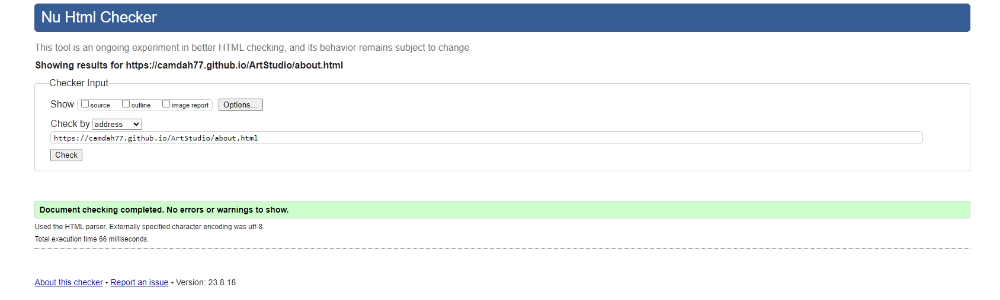

# ART STUDIO
Art Studio wants to increase creativity and wants to show that anyone can learn to make art. The creative process increases well-being and, just like physical activity, it gives a better mood, greater self-awareness and more energy. By offering membership at different levels, the site has great development potential as the number of members increases.
Art Studio a fictitious company, created as part of project work at the Code Institute.

## Tabel of contents
+ [UX](#ux "UX")
  + [Site Purpose](#site-purpose "Site Purpose")
  + [Site Goal](#site-goal "Site Goal")
  + [Business Strategy](#business-strategy "Business Strategy")
  + [Target Market](#target-market "Target Market")
  + [Communication](#communication "Communication")
+ [Design](#design "Design")
  + [Wireframe](#wireframe "Wireframe")
  + [Colour Scheme](#colour-scheme "Colour Scheme")
  + [Typography](#typography "Typography")
  + [Imagery](#imagery "Imagery")
+ [Features](#features "Features")
  + [Existing Features](#existing-features "Existing Features")
+ [Testing](#testing "Testing")
  + [Validator Testing](#validator-testing "Validator Testing")
  + [Unfixed Bugs](#unfixed-bugs "Unfixed Bugs")
+ [Technologies Used](#technologies-used "Technologies Used")
  + [Main Languages Used](#main-languages-used "Main Languages Used")
  + [Frameworks, Libraries & Programs Used](#frameworks-libraries-programs-used "Frameworks, Libraries & Programs Used")
+ [Deployment](#deployment "Deployment")
+ [Credits](#credits "Credits")
  + [Content](#content "Content")
  

## UX

### Site Purpose:
To increase awareness around the creative process and show all benefits the creation has to body and soul by step by step tutorials and inspirering lifestories.

### Site Goal:
The first goal is to attracts new user to sign up and become members. 
The user should clearly understand what is being provided and should easily navigate on the page.  

### Business Strategy:

Art Studio is a fictive company but I want to show the commercial thought behind it anyway.
By offering different level of memberships the has room to grow in line with increased revenue.
To attracts new members the site needs to frequently upload new classes, content and have other artist lifestories. 

### Target Market

Art Studio´s is a business to consumer company and the target market are mainly women 20-65 + years old.

### Communication
Communication plan will focus on: frequently update with new online classes, success stories and artwork from members.
Social channels will mainly be Facebook and instagram, since the target market the market are on those channels.

## Design

### Wireframe

To give a general overwiew of the layout and content I made a sketch in canva.com. 

### Colour Scheme:
The page is filled with images that will inspires to create. The page's colors can therefore not take over the page's message. The combination of #64A0A0 and small fragment of #F699CD gives a pleasant impression that does not overwhelm the user.
Material, as buttons and presentations are designed so the user feel recognition, no matter where on the site he/she is on. 
The headings on all pages is in #64A0A0, except for on the sign up page where it is #F699CD since the background is black I want the heading to stand out.

### Typography
There are two fonts used:

- League Spartan in headings, navigation and buttons
- Montserrat  is selected as the main font in the running text.
The combiantion of theese two fonts gives a serious but playful impression.
Buttons and presentations are made in canva.com.

### Imagery

Hero image on first page and on signup page are taken from canva.com.
All other images belongs to me, Camilla Dahlström. The artworks are made by me and gallery pictures are taken when I run an art gallery in Täby Centrum, 2021-2023.
All images have been exported in adoble Photoshop to WEBP-format.

## Features

### Existing Features

No existing features. The page is made for the fictitious company Art Studio

### Navigation Bar

The navigation bar is shown on all pages and are named so the user simpley know what to find under each page. 
The site´s goal is to get sign up´s so there are "Join now"-links at every page.

#### Landing Page:

- I want to wake the visitor's curiosity so I choose a playful and colorful hero image  with the message:  "Free your mind - find your creative voice". 
  The round button "Start making Art" links to the sign up-page 

- Under the hero image I inserted a mix of images and text. "The images are from art classes I held at my gallery in Stockholm, Sweden.
  The text messages are:  "Easy to start, Your creative journey can start today and quick start with practical excerises.
  At the landing page there is a section how simple it is to start the new hobby and what levels of membership Art Studio is offering. 
  In the end of the section it is a clickable link to the sign-up page on the right side of the page. 

- Since the goal for the page is to get sign-ups from the users I´m highlighting benefits of become a member. I am also presenting three different levels with 
  three different monthly fees. If this was a LIVE site this part should be connected to stripe for immediately payment-opportunity.
  In the end of the section it is a clickable link to the sign-up page on the right side of the page. 

- Last on the landing page the user can ses a picture of the creative mentor and a slideshow of sold artworks. As the site grows Art Studio can hightlight theire 
  differents mentors here and also theire members.

#### Inpspiration page

The inspiration page has two section. 

- I introduce the inspiration gallery with a short information It starts with an introduction text about the gallery. 
  In the end of the presentation I inserted a link to the sign up page. 

- In the photogallery I have added some of sold artwork. 
  As the amount of members are growing It is possible to use the inpiration page with artwork from members and theire sold pieces.

#### Tutorial page

The turtorial page should be a updated often with different free tutorials. 
Here Art Studio has possibility to put tutorials from members as well. 

- The tool kit tutorial contains four images with a desription. This part can frequently be added with new tutorials. 
  Under the section I have added a link to the sign up -page. 

- At the bottom of the tutorial page I added a video from YouTube- so the user can see a process of an artwork, as an inspiration. 
  In the windows there is a volum-controll and paus-function.

#### Connect page

 The connect site is containing one element: the form. 
 I did´nt add anything more here since the main focus should be the sign up. 

- Required fields are First name, Last name and e-mail adress. 
  I have also added two questions in a drowdown menu: What is your favorite material and what level of membership are you interested in? 

- The signed up user comes to a welcome page , saying Welcome to Art Studio. 
  Here can Art Studio make an welcome site with an tutorial or a log-in page.  

#### About

In the about page Art Studio put the story how the founder found the art.

- Contain three images
- Text in order to inspire 

#### Footer 

The footer contains three icons with links to Facebook, Instagram and You Tube.

### The future for Art Studio
As the amount of members grow the company can increase the functions:
- Directly email to those who sign up. 
- Set up payment solution
- Log In- page
- Member site so every member can upload and sell artworks
- Lifestory and gallery from artists
- Live chatbot
- Live-sessions

## Testing 

### Validator Testing 

- HTML: 
All pages were "Document checking complete. No errors or warning to show"

- CSS: 
Css-file is checking and complete.

- Lighthouse:

All links, internal and external is checked and are working.

## Technologies Used

### Main Languages Used
- HTML5
- CSS3

### Frameworks, Libraries & Programs Used
- Google Fonts - Font families:  League Spartan and Montserrat. San-serif was used as a default font.
- Font Awesome -Icons to the social links in the footer element and hamburger icon in navigation bar for 
  mobil devices.
- Code anywhere - In the begining of the project I used code anywhere but change to Git Pod because I found Git Pod 
  easier to use
- GitPod - The html files & styling sheet before pushing the project to Github.
- GitHub - to store my repository for submission.
- Canva.com - Designed images and presentations and saved as png-files
- Adobe Photoshop - were used to convert png-files to Webp-file. 
- Am I Responsive? - to ensure the project looked good across all devices.
- 
## Deployment
The site was deployed to GitHub pages. The steps to deploy are as follows:
- From this project's repository, navigate to the settings tab
- From the left hand menu, select pages.
- From the source section drop-down menu, select the Main Branch.
- Once the main branch has been selected, the page will refresh and provide a link to the live project.
- The live link can be found here  https://camdah77.github.io/ArtStudio/

## Credits

### Content

- Code Institute "Love Running project" 
  https://codeinstitute.net/
  The initial set up and first styling wera inspired by the 'Love Running' project. 
  I took inspiration for the design of the navigation bar, hero image and the display of the social links in the footer element.
  In the sign up page I was helped by the Love Running project to style my form. 

- W3School Online Web Tutorials 
  https://www.w3schools.com/
  Useful tutorials with flexbox, css and styling of ste site.

- Codepen
  https://codepen.io/
  Useful inspiration and tutorials from user. 

- Canva
  https://www.canva.com/ 
  Images, presentations are made in canva.com
  Hero image and image at the welcomepage is taken from canva´s image library.

### Thank you

- My mentor Lauren-Nicole Popich
  Lauren-Nicole has guided me in the right direction from start to finish. She has been extremely patient with me and has a great knowledge of coding. I am eternally grateful to her for this.

- My Cohort Facilitator David Calikes
  David always seems available to chat with his students and he has given me positive support which gave me energy to continue the project when I doubted my knowledge

- Code Institute Student Care
  At the beginning of the project, my mother died and I am very grateful that Student Care gave me time to complete my project later than the set deadline.

